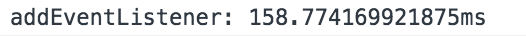

01. javascript-drum-kit

내 방식을 사용해서 풀었을 때는, playing 클래스를 제거하는 방식을 window.addEventListener를 통해 keyup에 classList.remove()메소드를 부여하는 방식으로 하였다.

그러나 솔루션에서는 함수를 정의하여 keys를 변수지정한 다음 forEach메소드를 통해 각각의 키에 트랜스폼이 끝난 경우 classList.remove를 통해 playing클래스를 자동으로 지우는 방법을 택했다.

내 방식과 솔루션의 차이는 해당 버튼을 꾹 누르고 있는 경우에 내 방식은 누르고 있는 동안 playing 클래스가 유지되며, 솔루션의 방식은 트랜스폼이 끝나면 다시 제거되었다가 바로 추가되는 차이가 있다.

두 방식의 성능을 console.time - console.timeEnd를 찍어서 확인해 본 결과, 같은 s버튼을 눌렀을 때의 차이는 다음과 같다.

솔루션의 방법이 거의 2배 가까이 시간차이가 난다.
이는 이벤트리스너를 사용하면 이벤트의 전파가 이루어지고, 전역객체에서 이벤트리스너를 호출하고 다시 거기 쿼리셀렉터를 사용해 dom을 제어하는 이용하기 때문인 것으로 보인다.

 
이번에는 html태그에서 data-* 어트리뷰트를 사용하는 법을 배웠고, arrow function 에서 this가 바인딩이 안된다는 것을 다시 상기하였다.

***

02. css-js-Clock

내 방식과 솔루션의 차이 중 하나는 DOM을 변수지정할 때, 나는 document.getElementsByClassName을 사용했고, 솔루션은 querySelector를 사용했다는 것이다. 내가 저 방식을 사용한 이유는, 쿼리셀렉터의 경우 (HTMLCollection)이 아닌 nodelist의 형식으로 불러와지는데, 이는 정적 컬렉션이라 셀렉트 되는 시점의 상태에 고정되는 것이라 하였다. 물론 이 예제에서 이것이 바뀌어지지 않지만, 만약 큰 프로젝트에서는 고려해줘야 할 것 같아서 이를 사용했다.(물론 Array.from을 쓰거나 call로 체이닝해도 된다.)

이후에는 시계바늘을 침별로 다른 스타일을 적용하여 가독성을 높였고, 또한 디지털 시계를 추가해 보았다.

***

03. css-variables

여지껏 공부해 오면서, sass를 사용해왔기 때문인지, css 변수사용을 처음 겪어보았다. :root 에 변수를 --변수명 이런 형태로 저장하고, 해당 변수를 사용할때 style: var(--변수명); 이런 방식으로 사용하는 것이다. sass가 없을 때에는 유용했을 것 같지만, sass가 훨씬 직관적이고 편하게 쓸 수 있을 것 같다.($변수명)

역시 저번에도 나왔던 nodelist와 HTMLCollection의 차이가 여기서도 나왔었고, 여기서는 nodelist의 forEach 메소드를 사용하였다. data어트리뷰트를 사용하는 것도 자바스크립트로 제어하기에 유용한 기능인 것 같다. this.dataset. 의 방식으로 접근하기 쉬우니까.

또한 이 :root 를 셀렉트하기 위해서 document.documentElement를 사용한 것도 이 주제에서 처음 보았다. setProperty(바꿀속성명, 내용) 이 메소드는 본 적이 있지만, 사용할 때는 style.marginTop = '30px' 이런 방식을 사용하기 때문에 잘 사용한 적이 없었다.
하지만 이번 경우처럼, 제어해야 할 속성이 가변적인 경우, 템플릿 리터럴을 통해 무엇인지 정해주고, 얼마만큼인지 주기 위해서는 이 setProperty()메소드가 적절해 보인다.

***

04. array-cardio-1

이번 주제는 자바스크립트 배열객체의 메소드 들을 익히는 것이였다.
기존에 많이 썼던 map(), sort()메소드나 filter()메소드의 경우 자주 사용해서 익숙한 것이였지만, reduce()메소드의 경우 이번에 처음 사용해보는 것이였다. 확실히 reduce 메소드는 계산을 쉽게 해준다는 장점이 있었다. 하지만 내가 아직 익숙하지 않아서 인지 for문을 돌리는 것이 더 쉽긴 했다. 메소드를 자주 써서 익숙하게 만들어야 겠다.

string객체의 includes()메소드도 처음 사용하는 것이였다.
내장객체들의 속성과 메소드들은 사실 맨날 쓰는 것만 써서, 이렇게 다른 사람이 하는 것을 봐야 하나씩 익히기 시작하는 것 같다. 발전을 위해서는 모질라나 구글링을 통해 다양한 메소드 들을 찾아보고 쉬운 예제들을 가끔 해보는 것이 필요함을 느꼈다.

문제를 풀던 중, 문자열에서 성과 이름을 분리하는 과정을 거칠 때, 나는 정규표현식을 사용하여, match를 통해 이름을 골라낸 다음 소팅하려고 했었다. 이 방식은 내가 아직 정규표현식에 미숙하여 이름 전체를 정규표현식으로 캐칭하지 못하고 이름의 일부만 찾아서 소팅하는 방식을 사용해, 완전하다고 보기 힘들고 코드가 길어졌다.
솔루션의 경우, split()메소드로 ,을 기준으로 분리하여, 디스트럭쳐링 구문을 사용함으로 훨씬 코드가 간단하고, 분리가 쉬워졌다.

    const [aLast, aFirst] = lastOne.split(', ')

이외에도, 아직 자바스크립트의 내장객체 메소드들에 대해 부족한 것이 많고 더 알아봐야 겠다는 반성을 하게되는 챕터였다.

  ***

  05. flex-pannel-gallery

  이번 방법에서는 css transform 을 통해 translate 애니메이션을 만든 다음, addEventListener를 통해 클릭이벤트 발생 시 해당 애니메이션을 실행하는 방법을 썼다.
  내 방식에서는 각 패널에 일일이 이벤트를 부여하는 방식을 썼었으나, 솔루션 방식에서는 nodelist의 forEach메소드를 사용했다. 이것이 훨씬 직관적이고 코드가 간단하였다.

  또한 부모가 flex box일때, 자식 노드들도 flex를 선언해줘야 함을 알았다. 이전에는 계속 습관적으로 붙혔었는데, 이제는 이유를 알게 되었다. 선언하지 않으면 그냥 block박스인 것이다. (하지만 flex의 속성을 적용하면 일부 먹는 것이 있다.)

  그리고 transform이 발생하여 애니메이션이 실행될 때, transitionend에서는 변하는 것들이 다 들어간다. (이번 예제에서는 flex-grow와 font-size이다.) 따라서 transitionend 이벤트에 핸들러를 추가할 때에는 그것중 하나를 셀렉트 해줘야 한다는 것을 알았다.
