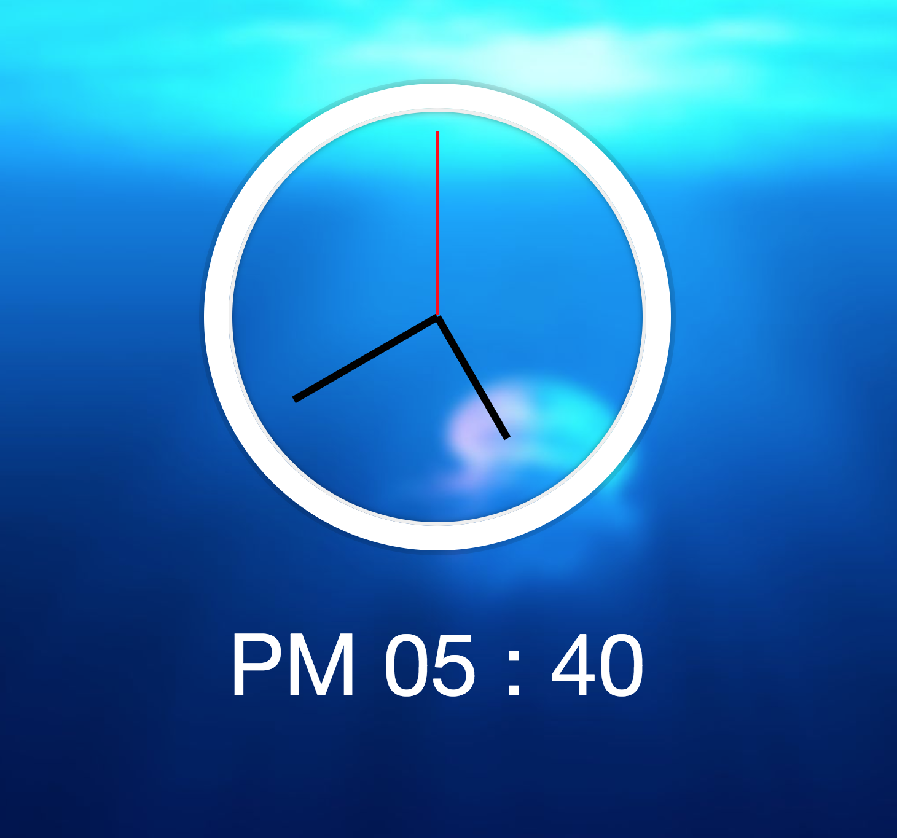
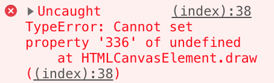

01. javascript-drum-kit

내 방식을 사용해서 풀었을 때는, playing 클래스를 제거하는 방식을 window.addEventListener를 통해 keyup에 classList.remove()메소드를 부여하는 방식으로 하였다.

그러나 솔루션에서는 함수를 정의하여 keys를 변수지정한 다음 forEach메소드를 통해 각각의 키에 트랜스폼이 끝난 경우 classList.remove를 통해 playing클래스를 자동으로 지우는 방법을 택했다.

내 방식과 솔루션의 차이는 해당 버튼을 꾹 누르고 있는 경우에 내 방식은 누르고 있는 동안 playing 클래스가 유지되며, 솔루션의 방식은 트랜스폼이 끝나면 다시 제거되었다가 바로 추가되는 차이가 있다.

두 방식의 성능을 console.time - console.timeEnd를 찍어서 확인해 본 결과, 같은 s버튼을 눌렀을 때의 차이는 다음과 같다.

솔루션의 방법이 거의 2배 가까이 시간차이가 난다.
이는 이벤트리스너를 사용하면 이벤트의 전파가 이루어지고, 전역객체에서 이벤트리스너를 호출하고 다시 거기 쿼리셀렉터를 사용해 dom을 제어하는 이용하기 때문인 것으로 보인다.

 
이번에는 html태그에서 data-* 어트리뷰트를 사용하는 법을 배웠고, arrow function 에서 this가 바인딩이 안된다는 것을 다시 상기하였다.

***

02. css-js-Clock

내 방식과 솔루션의 차이 중 하나는 DOM을 변수지정할 때, 나는 document.getElementsByClassName을 사용했고, 솔루션은 querySelector를 사용했다는 것이다. 내가 저 방식을 사용한 이유는, 쿼리셀렉터의 경우 (HTMLCollection)이 아닌 nodelist의 형식으로 불러와지는데, 이는 정적 컬렉션이라 셀렉트 되는 시점의 상태에 고정되는 것이라 하였다. 물론 이 예제에서 이것이 바뀌어지지 않지만, 만약 큰 프로젝트에서는 고려해줘야 할 것 같아서 이를 사용했다.(물론 Array.from을 쓰거나 call로 체이닝해도 된다.)

이후에는 시계바늘을 침별로 다른 스타일을 적용하여 가독성을 높였고, 또한 디지털 시계를 추가해 보았다.

***

03. css-variables

여지껏 공부해 오면서, sass를 사용해왔기 때문인지, css 변수사용을 처음 겪어보았다. :root 에 변수를 --변수명 이런 형태로 저장하고, 해당 변수를 사용할때 style: var(--변수명); 이런 방식으로 사용하는 것이다. sass가 없을 때에는 유용했을 것 같지만, sass가 훨씬 직관적이고 편하게 쓸 수 있을 것 같다.($변수명)

역시 저번에도 나왔던 nodelist와 HTMLCollection의 차이가 여기서도 나왔었고, 여기서는 nodelist의 forEach 메소드를 사용하였다. data어트리뷰트를 사용하는 것도 자바스크립트로 제어하기에 유용한 기능인 것 같다. this.dataset. 의 방식으로 접근하기 쉬우니까.

또한 이 :root 를 셀렉트하기 위해서 document.documentElement를 사용한 것도 이 주제에서 처음 보았다. setProperty(바꿀속성명, 내용) 이 메소드는 본 적이 있지만, 사용할 때는 style.marginTop = '30px' 이런 방식을 사용하기 때문에 잘 사용한 적이 없었다.
하지만 이번 경우처럼, 제어해야 할 속성이 가변적인 경우, 템플릿 리터럴을 통해 무엇인지 정해주고, 얼마만큼인지 주기 위해서는 이 setProperty()메소드가 적절해 보인다.

***

04. array-cardio-1

이번 주제는 자바스크립트 배열객체의 메소드 들을 익히는 것이였다.
기존에 많이 썼던 map(), sort()메소드나 filter()메소드의 경우 자주 사용해서 익숙한 것이였지만, reduce()메소드의 경우 이번에 처음 사용해보는 것이였다. 확실히 reduce 메소드는 계산을 쉽게 해준다는 장점이 있었다. 하지만 내가 아직 익숙하지 않아서 인지 for문을 돌리는 것이 더 쉽긴 했다. 메소드를 자주 써서 익숙하게 만들어야 겠다.

string객체의 includes()메소드도 처음 사용하는 것이였다.
내장객체들의 속성과 메소드들은 사실 맨날 쓰는 것만 써서, 이렇게 다른 사람이 하는 것을 봐야 하나씩 익히기 시작하는 것 같다. 발전을 위해서는 모질라나 구글링을 통해 다양한 메소드 들을 찾아보고 쉬운 예제들을 가끔 해보는 것이 필요함을 느꼈다.

문제를 풀던 중, 문자열에서 성과 이름을 분리하는 과정을 거칠 때, 나는 정규표현식을 사용하여, match를 통해 이름을 골라낸 다음 소팅하려고 했었다. 이 방식은 내가 아직 정규표현식에 미숙하여 이름 전체를 정규표현식으로 캐칭하지 못하고 이름의 일부만 찾아서 소팅하는 방식을 사용해, 완전하다고 보기 힘들고 코드가 길어졌다.
솔루션의 경우, split()메소드로 ,을 기준으로 분리하여, 디스트럭쳐링 구문을 사용함으로 훨씬 코드가 간단하고, 분리가 쉬워졌다.

    const [aLast, aFirst] = lastOne.split(', ')

이외에도, 아직 자바스크립트의 내장객체 메소드들에 대해 부족한 것이 많고 더 알아봐야 겠다는 반성을 하게되는 챕터였다.

  ***

  05. flex-pannel-gallery

  이번 방법에서는 css transform 을 통해 translate 애니메이션을 만든 다음, addEventListener를 통해 클릭이벤트 발생 시 해당 애니메이션을 실행하는 방법을 썼다.
  내 방식에서는 각 패널에 일일이 이벤트를 부여하는 방식을 썼었으나, 솔루션 방식에서는 nodelist의 forEach메소드를 사용했다. 이것이 훨씬 직관적이고 코드가 간단하였다.

  또한 부모가 flex box일때, 자식 노드들도 flex를 선언해줘야 함을 알았다. 이전에는 계속 습관적으로 붙혔었는데, 이제는 이유를 알게 되었다. 선언하지 않으면 그냥 block박스인 것이다. (하지만 flex의 속성을 적용하면 일부 먹는 것이 있다.)

  그리고 transform이 발생하여 애니메이션이 실행될 때, transitionend에서는 변하는 것들이 다 들어간다. (이번 예제에서는 flex-grow와 font-size이다.) 따라서 transitionend 이벤트에 핸들러를 추가할 때에는 그것중 하나를 셀렉트 해줘야 한다는 것을 알았다.

***

06. type-ahead

이번에는 글자를 form에 타이핑하면, 해당하는 글자를 포함한 리스트들을 보여주는 방식을 코딩했다. 흔히 검색엔진에서 사용하는 방식이였다. 놀라운 것은, 나는 이것을 rxjs라고 하는 리액티브 프로그래밍 라이브러리를 사용해서 구현한다고 알고 있었는데, 순수 자바스크립트로도 구현이 가능한 것이 놀라웠다. 물론 fetch API를 통해 json파일로 해당 데이터를 불러오고, 그것을 정규표현식을 통해 파싱한 다음, 배열에 필터를 적용했고, 그 필터된 배열에 map을 통해 템플릿 리터럴로 html코드를 스트링 타입으로 변환한 다음 이것을 리턴하여 ul태그의 innerHTML에 넣어서 리스트를 만들었다.

여태까지 비록 많은 편을 수행하진 못했지만, 이번 문제가 가장 인상적이였다. 순수 자바스크립트의 힘을 느꼈달까. 뭔가 요즈음 다양한 라이브러리들이 많이 나오고 있는데, 사실 기본에 충실하면 다 커버할 수 있다는 점을 깨닫게 해 주었다.

이번 문제를 통해 정규식에 변수를 넣는 법을 배웠다. 예전에 공부하면서 궁금했던 내용이였지만, 검색해도 잘 안나오길래 잠깐 잊고있었는데, 이번에 확실히 알게 되었다. new RegExp 생성자를 통해 변수를 프롭으로 넣어주면 되는 것이였다.

또 html문법을 리턴하는 것이 리액트의 jsx와 비슷하였지만, 스트링을 리턴하고 innerHTML에 넣는 방식으로 dom을 새로 그리는 방법도 있다는 것을 알게 되었다. 만약 프로젝트의 규모가 커지게 된다면, (예를들어 검색엔진 같은 경우) 리액트가 이 방식보다 더 적절할까? 사실 유지보수의 측면에서는 리액트로 통일하는 것이 더 편할 것 같으나, 성능적인 차이에서는 확신하기 어렵다.

*웹으로 검색해본 결과, innerHTML의 경우는 xss 이슈에서 취약하다고 한다.  

*fetch API는 프로미스를 리턴한다.

*웹API는 컨텐츠가 하드웨어나 데이터저장소에 접근하기 위한 기기전환, 접근 API들의 모음이다.

***

07. array-cardio-day-2

이번 과제는 배열의 메소드를 배우는 시간이였다. some(), every()의 메소드는 처음 공부할 때 배우고는 그 이후로 써먹지 않았던 것이였는데, 이번에 다시 상기시켜 줘서 좋았다.

그리고 마지막 문제에서 redux의 경우 원본을 유지하면서 새로운 배열은 만드는 방법으로

    const index = comments.findIndex((comment)=>comment.id==823423)
    const newComments = [
      ...comments.slice(0, index),
      ...comments.slice(index+1)
    ]

이 방식을 사용했는데, 실제로 쓰이고 있는지 궁금하다.
내 생각에는 filter()를 사용하는 것이 더 효과적일 듯 한데 왜 filter()를 안썼는지...

        console.table(comments.filter((comment)=>comment.id !== 823423))

filter()의 경우도 원본유지가 되기 때문이고, 위의 코드보다 훨씬 간단하다.

***

08. fun-with-html-Canvas

이번 문제는 html5의 canvas태그를 통해 마우스로 선을 그리는 것을 코딩했다. canvas는 처음 공부할 때는 그리 중히 여기진 않았는데, 이것저것 혼자 공부하다 보니 몇번 보게 되어서 최근들어 많이 살펴보았다.

문제의 솔루션에서는 디스트럭쳐링 구문으로 최근 위치를 이전 마우스의 오프셋 위치로 정하였는데, 이를 draw() 함수 내부에 정의하는 과정에서, 밖의 이벤트리스너의 함수와 중복되면서 그것이 프로퍼티 처리가 되어 오류가 났다.

    [lastX, lastY] = [e.offsetX, e.offsetY]

따라서 디스트럭쳐링이 아닌 다음과 같이 풀어 쓰는 것이 의도한 결과를 내었다.

    lastX = e.offsetX
    lastY = e.offsetY

또한 내 방식으로는 mouseover이벤트에 처리하여

    cvs.addEventListener('mousemove', (e)=> {
      lastX = e.offsetX
      lastY = e.offsetY
    })

이러한 방식을 사용했는데, 솔루션에서는 mousedown을 사용하여, 한번 클릭했을 때 점이 찍히고 안찍히고의 차이인줄 알았지만, mousedown이였을 때도, 한번 클릭시 점이 찍히지 않았다. 이는 lastX와 lastY가 아직 위의 오프셋으로 초기화되지 않았기 때문이라고 생각한다. //이것이 아니라 moveTo와 lineTo가 동일하여 path가 찍히지 않았던 것이다.

***

09. dev-tools-domination

이번 문제에서는 console 객체의 여러 메소드 들을 살펴봤다. 기존에 알고있던 .log(), .table(), .time(), .timeEnd(), .groupCollapsed(), .groupEnd(), warn(), info(), error() 가 있었고, 추가로 알게 된, assert(), count()등이 있었다. 이러한 것들은 디버깅 시 활용하면 유용하게 쓰일 수 있는 메소드들이다. 물론 lint등의 디버깅 툴을 쓰기도 하지만, 문법적인 것들만 걸러줄 뿐, 실제로 내가 원하는 결과를 제대로 담고 있나, 데이터가 제대로 바인딩 되었나를 살펴볼 때에는 이런식으로 콘솔에 찍어보는게 가장 간편하고 정확한 방식인 것 같다.

***

10. hold-shift-and-checkboxes

이번 문제는 정말 골머리가 썩었다... 시프트 키를 누르고 있는 동안 다른 체크박스를 클릭하면 이전에 체크한 것과의 사이의 체크박스들이 모두 다 체크가 되게 하는 기능을 구현하는 것이였는데, 나는 처음에 이 문제를 접하고 input태그의 checked속성을 몰라서, 우선 class로 .checked를 만들고 여기에 체크가 된다면 들어가 스타일룰을 넣고, 이벤트 리스너로 인풋태그를 클릭시 checked클래스를 classList.add(), classList.remove()를 통해서 적용하도록 기본 세팅을 바꾸었다.

그러나 여기까지는 좋았으나, 다음 시프트 멀티 체킹 기능을 구현함에 있어 문제가 있었다. 이벤트 리스터를 통해 시프트키가 눌러져 있는 동안, keydown이벤트로 시프트 변수를 true로 놓고, keyup이벤트시 다시 false로 바꾸는 방식으로 시프트 키 홀딩을 만들었고,
이것이 true인 동안 인풋태그에 새로운 이벤트 리스너를 넣어서 첫 클릭과 다음 클릭 사이의 인풋 태그의 부모에 class를 추가하는 방법을 구현했다. 
처음에는 이 방식은 성공적이였다. 그러나 체크박스의 체크표현이 되지 않았고, keyup이벤트시 다시 위에서 새로 부여한 이벤트리스너를 초기화해야 하는데, 이에 실패했다.

이유는 우선 그 위에 그냥 addEventListener를 새로 했을 시에는 이벤트가 중복적용이라 그런지 원하는 뷰를 그리지 못했고, 또한 removeEventListener 메소드를 사용하고자 하였으나, 익명함수가 아닌 밖에서 선언한 함수를 호출할 때에는 map의 인수로 들어간 인덱스 변수를 해당 함수의 매개변수에 넣기를 실패했기 때문이다. 

위에서 첫번째 기능구현엔 성공하였더라도, 반복문과 조건문이 많아서 가독성이 떨어지는 코드였다.
그러나 input태그의 checked속성과 이벤트가 가진 shiftKey 속성을 알고 있었으면, 정말 간단하게 구현이 가능한 기능이였다. 위의 이벤트 리스너 중복과 초기화 문제를 전혀 겪지 않고 간단한 코드 몇줄로 구현이 가능했다.

아직 내가 기본적인 내장객체와 dom 엘리먼트에 대해서 잘 알지 못하고 있었다... 자주쓰는 메소드들만 외우다 보니 커버리지가 작아지는 것 같다. HTML의 태그와 기본 이벤트의 프로퍼티들을 자주자주 찾아봐야 겠다..

***

11. custom video player

저번 문제에서 배운 교훈이 있어서 이번 문제는 꽤나 수월하게 해결했다. video태그의 내부 속성을 console에 로깅하여서 내부 프로퍼티를 확인하였고, 또 mdn문서를 통해 메소드를 확인하였다. 하지만 솔루션과의 차이는 코드의 길이였다. 확실히 솔루션의 방식이 정말 짧고 간단한 코드로 이루어져 있었다. 처음 보는 방식의 코딩컨벤션도 있었다.

    progress.addEventListener('mousemove',(e)=> mousedown && scrub(e))

이런 방식으로, mousedown이 참인 경우만 scrub(e)함수를 실행한다는 컨텍스트를 처음 보았다.
이외에도, 내 코드보다 훨씬 짧게 코딩한 경우는, 같은 메소드를 사용하는 경우, 각각 이벤트리스너를 준게 아니라, dom 엘리먼트를 불러올때 아예 노드리스트로 불러와서 forEach()를 통해 부여한 경우이다. 훨씬 직관적이고 깔끔해보였다.

    skipButtons.forEach(button => button.addEventListener('click', skip))

이외에도 알게 된 사실이나 중요한 부분들을 짧게 메모하겠다.

* data-* attr에 숫자를 넣으면 나중에 쓸때 parseInt나 parseFloat 해줘야함
* textContent를 쓰는게 좋다. innerHTMl은 파싱에 의한 성능상의 단점, xss이슈등이 있고, innerText는 스타일링이 되어 레이아웃이 변할수도 있다.
* querySelector는 대상이 여러개 있을 시 맨 앞줄의 것만 셀렉팅된다.

***
